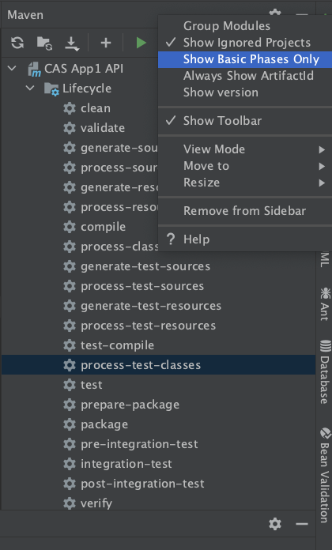

# ddd-playground

## [JPA × jMolecules で DDD をコードで表現する](https://springfest2020.springframework.jp/#sessions)

## [presentation materials](https://speakerdeck.com/kiyotakeshi69/spring-fest-2020-express-ddd-using-jpa-x-jmolecules)

## IntelliJ setting

You need to activate `Byte Buddy` at build time.

```
Preference > Build, Execution, Deployment > Build Tools > Maven > Runner  
Set "Delegate IDE build/run actions to Maven" to "On". 
```

- using `process-test-classes` to use Byte Buddy
